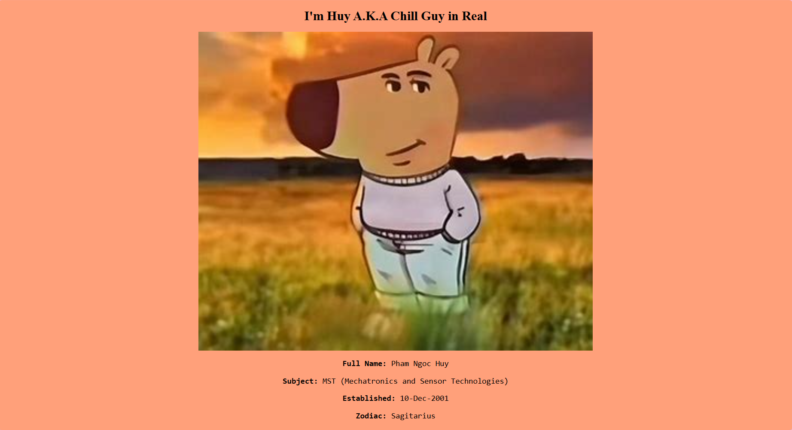
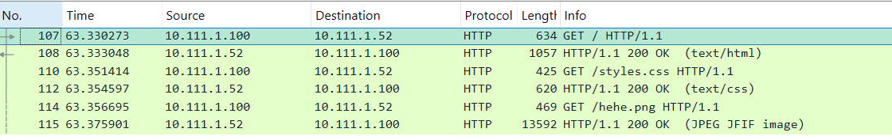

# Assignment 2 (sep style)

## Part: Adjust

### `/www/index.html`
- Different from the previous version, the CSS is now separated into an external file.
- Updated structure:
  ```
  www/
  ├── index.html
  ├── style.css
  ├── hehe.png
  ```
- Changes in `index.html`:
  - From:
    ```html
    <style>
      body {
        background-color: lightsalmon;
      }
      h1 {
        color: black;
        text-align: center;
      }
      p {
        font-family: monospace;
        font-size: 20px;
        text-align: center;
      }
      .center {
        display: block;
        margin-left: auto;
        margin-right: auto;
        width: 50%;
      }
    </style>
    ```
  - To:
    ```html
    <link rel="stylesheet" href="style.css">
    ```

### `style.css`
```css
body {
    background-color: lightsalmon;
}
h1 {
    color: black;
    text-align: center;
}
p {
    font-family: monospace;
    font-size: 20px;
    text-align: center;
}
.center {
    display: block;
    margin-left: auto;
    margin-right: auto;
    width: 50%;
}
```

## Server Management

### Run the Server (Windows):
```sh
./server_start.bat
```

### Stop the Server (Windows):
```sh
./server_stop.bat
```

## Hosting Information
- Hosted on: `localhost:80`
- Configuration file adjusted.
- You can verify settings in: `/usr/local/apache2/conf/httpd.conf`.

## Result:


## Connection WireShark


### Explanation  
This Wireshark capture shows an HTTP transaction between a client (`10.111.1.100`) and a server (`10.111.1.52`). 
The client first requests the main webpage (`GET /`), and the server responds with an `HTTP/1.1 200 OK`, delivering the HTML content. 
The client then makes additional requests for resources like `styles.css` and `hehe.png`, and the server responds accordingly. 
This sequence represents a typical web page load, where a browser retrieves the main HTML file along with its dependencies, such as stylesheets and images.
