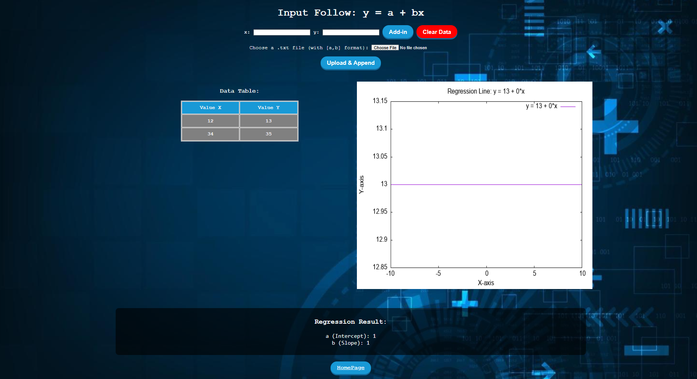

# Assignment 3 - CGI-Based Linear Regression System

## Project Structure

```
/udrive
├── /cgi-bin
│   ├── clear.pl
│   ├── comments.pl
│   ├── display.pl
│   ├── gnuplot.pl
│   ├── regression_calculation.pl
│   ├── uploadnread.pl
│
├── /www
│   ├── /demo_form
│   │   ├── data.txt
│   │   ├── form.html
│   │   ├── params.txt
│   │   ├── plot_script.plt
│   │   ├── plot.png
│
├── /GNU (installed location)
│
├── background_image.jpg
├── index.html
```

---

## Data Storage

### `data.txt`
- **Path:** `/www/demo_form/data.txt`
- Stores `(x, y)` values for regression calculations.
- New values are appended via form submissions.

---

## CGI Script Functionalities (Perl)

### `comments.pl`
#### **Functionality**
1. Accepts `x` and `y` parameters from an HTTP request.
2. Appends these values to `data.txt`.
3. Reads stored values and displays them in an HTML table.
4. Redirects users to `form.html`.

---

### `regression_calculation.pl`
#### **Linear Regression Calculation**
1. **Initialize CGI Object** - Handles HTTP request and response formatting.
2. **Read Data from File** - Extracts `(x, y)` pairs from `data.txt`.
3. **Validate Data** - Returns an error if no data is available.
4. **Calculate Regression Parameters**:
   - Computes summations: `∑x`, `∑y`, `∑xy`, `∑x²`.
   - Uses least squares regression formula:
     - `b = (n * ∑xy - ∑x * ∑y) / (n * ∑x² - (∑x)²)`
     - `a = (∑y - b * ∑x) / n`
5. **Save Computed Values** - Writes `a` (intercept) and `b` (slope) to `params.txt`.
6. **Output Results** - Displays results as plain text.

---

### `uploadnread.pl`
#### **Functionality**
1. Reads uploaded `.txt` file content.
2. Validates and appends it to `data.txt`.
3. Displays updated data in an HTML `<pre>` block.

---

### `clear.pl`
#### **Functionality**
1. Clears the following files:
   - `data.txt` (stored values)
   - `params.txt` (regression parameters)
   - `plot_script.plt` (Gnuplot script)
2. Opens each file in write mode (`'>'`), truncating its contents.

---

### `gnuplot.pl`
#### **Functionality**
1. Reads regression parameters (`a`, `b`) from `params.txt`.
2. Generates a Gnuplot script to plot the regression line.
3. Executes the script to create `plot.png`.

---

### `display.pl`
#### **Functionality**
- Reads `plot.png` and serves it as an image response.

```perl
print "Content-type: image/png\n\n";

my $output_png = "/www/demo_form/plot.png";

open(my $img, '<:raw', $output_png) or die "Cannot open image: $!";
binmode STDOUT;
print while (<$img>);
close($img);
```

---

## HTML Files

### `index.html`
- Homepage with a styled button for navigation.
- Button transitions to `form.html`.

```html
<div class="button-container">
    <a href="/demo_form/form.html" class="button-19">START!</a>
</div>
```

---

### `form.html`
- Contains CSS and JavaScript to interact with Perl scripts.
- Keeps track of data in real-time without reloading the page.
- Uses JavaScript functions to fetch and update data.

**Core Functions:**
- `loadTable()`
- `loadRegressionResults()`
- `loadPlot()`
- `clearData()`
- `uploadFileAndAppendContent()`
- `inputForm` handling
- Auto-loads data on page load

---

## JavaScript Functionalities

### **Data Fetching & Display**

#### `loadTable()` - Fetch and display stored dataset
```javascript
function loadTable() {
    fetch("/cgi-bin/comments.pl")
        .then(response => response.text())
        .then(data => {
            document.getElementById('tableContainer').innerHTML = `<h3>Data Table:</h3><pre>${data}</pre>`;
        })
        .catch(error => console.error("Error loading table:", error));
}
```

#### `loadRegressionResults()` - Fetch and display regression results
```javascript
function loadRegressionResults() {
    fetch("/cgi-bin/regression_calculation.pl")
        .then(response => response.text())
        .then(data => {
            document.getElementById("regressionResults").innerHTML = `<h3>Regression Result:</h3><pre>${data}</pre>`;
        })
        .catch(error => console.error("Error fetching regression results:", error));
}
```

#### `loadPlot()` - Generate and fetch regression plot
```javascript
function loadPlot() {
    fetch('/cgi-bin/gnuplot.pl')
        .then(response => {
            if (!response.ok) throw new Error('Failed to generate plot');
            return fetch('/cgi-bin/display.pl');
        })
        .then(response => response.blob())
        .then(blob => {
            const imageUrl = URL.createObjectURL(blob);
            document.getElementById('plotting').innerHTML = ``;
        })
        .catch(error => console.error('Error loading plot:', error));
}
```

---

### **Data Management & User Actions**

#### `clearData()` - Clears stored data and refreshes UI
```javascript
function clearData(){
    event?.preventDefault();
    fetch("/cgi-bin/clear.pl")
    .then(() => {
        loadTable();
        loadRegressionResults();
        loadPlot(); 
    })
    .catch(error => console.error("Error clearing data:", error));
}
```

#### `uploadFileAndAppendContent()` - Uploads and appends file data
```javascript
function uploadFileAndAppendContent() {
    event?.preventDefault();
    let formData = new FormData(document.getElementById("uploadForm"));

    fetch("/cgi-bin/uploadnread.pl", {
        method: "POST",
        body: formData
    })
    .then(() => {
        loadTable();
        loadRegressionResults();
        loadPlot();
    })
    .catch(error => console.error("Error uploading file:", error));
}
```

#### Auto-load data on page load
```javascript
window.onload = function() {
    loadTable();
    loadRegressionResults();
    loadPlot();
};
```

## Result:
### INTRO PAGE


### INPUT PAGE


### WITH DATA
